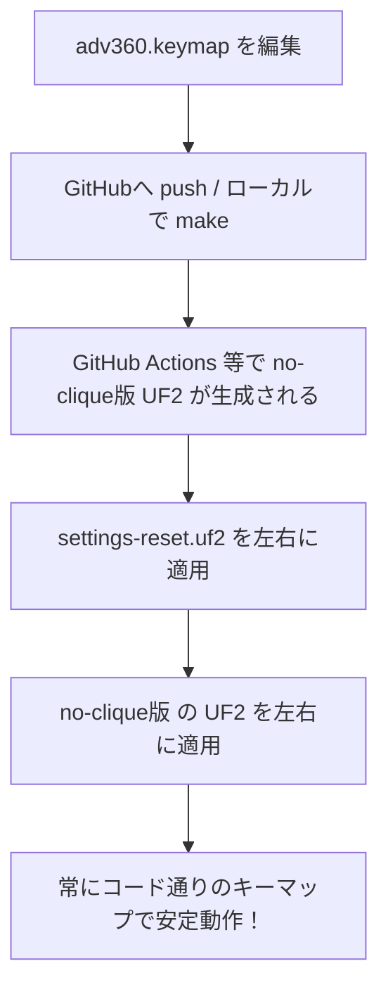

# ZMKファームウェア管理・トラブルシューティングガイド

Kinesis Advantage360 Pro（ZMKエンジン搭載）において、GUIツール（Kinesis Clique / ZMK Studio）とコード直接編集（Git/Legacyビルド）の間で発生する仕様の競合、およびレイヤーのインデックスに関する罠と解決策をまとめたドキュメントです。1年後に見返してもすぐに思い出せるように構成されています。

---

## 1. ZMKにおけるキーマップの優先度と「上書き」の罠

ZMKファームウェアには、キーマップの読み込みに関して「プログラム（UF2）」と「内蔵メモリ（NVS領域）」の2つのソースが存在します。この挙動の違いが、書き換えたキーマップが反映されない最大の原因です。

### ビルドタイプによる動作の違い

| 項目 | Clique/ZMK Studio対応版 (`CONFIG_ZMK_STUDIO=y`) | Legacyビルド版 (`CONFIG_ZMK_STUDIO=n`) |
| :--- | :--- | :--- |
| **ソース優先度** | **内蔵メモリ（NVS）の内容が最優先** | **UF2プログラム内のコードが常に優先** |
| **起動時の挙動** | NVS領域にデータがあればそれをロード。<br>空（初期化前）ならUF2のキーマップを初期値としてNVSへコピーし起動。 | NVS領域のキーマップデータを完全に無視し、UF2コードのキーマップで常に起動。 |
| **GUIでの編集** | 可能（通信してNVS内のデータを書き換える） | 不可（通信窓口が閉じているため） |

> [!WARNING]
> **Clique対応版の罠**
> 一度でもClique対応版ファームウェアで起動したり、GUIから設定を保存したりすると、内蔵メモリ（NVS）にキーマップが保存されます。この状態になると、**いくらコード側のキーマップを変更してUF2ファイルを新しく書き込んでも、起動時に古いNVSデータが優先されてしまうため、変更が一切反映されません。**

---

## 2. Settings Reset（設定初期化）の正しい手順と罠

本体メモリ（NVS）に残っている古い設定や他レイヤーの上書き設定をクリアするには、`settings-reset.uf2` を使ったリセットが必要です。

### ⚠️ やってはいけない手順（罠）
1. `settings-reset.uf2` でリセットする。
2. **「一旦動くか確認するため」に Clique 対応のファクトリーデフォルト（QWERTY）のファームウェアを入れて起動する。**
3. その後に「自分用カスタムファームウェア（Dvorak）」を書き込む。

> [!CAUTION]
> ステップ2で Clique 対応のファクトリーデフォルトを起動した時点で、空になったNVS領域(Clique キーマップデータ保持用)に「ファクトリーデフォルト（QWERTY）」のキーマップが初期値として自動保存されてしまいます。そのため、その後にカスタムファームウェアを書き込んでも、手順3 of 起動時にはステップ2のQWERTYデータが優先ロードされ、Dvorakになりません。

### ✅ 正しい手順
設定メモリをクリアした後は、**他のファームウェアを一切挟まず、直接ご自身のカスタムファームウェアを書き込む**必要があります。

1. **左モジュール**をPCに接続 ➔ リセット穴をダブルクリック ➔ マウントされたフォルダに `settings-reset.uf2` をドロップ。
2. 自動再起動して**再びドライブが開いたら、間マップ入れずに**ご自身のカスタムファームウェア（左用）をドロップ。
3. **右モジュール**も同様に、`settings-reset.uf2` を書き込む ➔ 再度開いたドライブにカスタムファームウェア（右用）をドロップ。

※スプリットキーボードの仕様上、左右どちらか片方だけに古いNVSデータが残っていると、接続した瞬間に古い設定がもう片方へ同期されてしまうため、**必ず左右両方とも同じタイミングでリセット＆書き込み**を行ってください。

---

## 3. ZMK Studio無効（Legacy）ビルド時の「レイヤー消滅」の罠

`no-clique`（Legacy）ビルドを行う際、特定のレイヤー定義がコンパイラによってスキップされ、レイヤー切り替え（Modキーなど）が動かなくなる極めて難解なバグです。

### バグのメカニズム
キーマップ定義ファイル（`adv360.keymap`）内に、ZMK Studio用のダミー枠として以下のような定義が存在する場合があります。

```dtsi
    // layer 5
    extra1 { 
      display-name = "Extra1";
      status = "reserved"; // 🪓 これが罠の原因
    };
```

1. **ZMK Studio無効ビルド（Legacy版）**では、`status = "reserved";` が設定されているレイヤーノードは「不要なもの」とみなされ、**ビルド対象から完全に除外（スキップ）**されます。
2. これにより、定義ファイル上は全8レイヤー（インデックス0〜7）であっても、コンパイル後の実機内ではレイヤー5と6が消滅し、全6レイヤー（インデックス0〜5）になります。
3. 繰り上がった結果、一番上の `mod` レイヤーは実機内で **「レイヤー5」** としてビルドされます。
4. しかし、コード上のキー定義は依然として `#define L_MOD 7`（つまり `&mo 7`）のままです。
5. キーを押すと、キーボードは実機内に存在しない、あるいは空っぽの「レイヤー7」に切り替えようとします。その結果、**LEDはModの色に変わるものの、すべてのキー入力が透明キー（`&trans`）として処理され、レイヤー0（または1）の文字がそのまま入力される**という現象が発生します。

### 解決策
ZMK Studioを無効にする場合でもレイヤーのインデックス（順番）がズレないよう、`status = "reserved";` を削除し、**すべて `&trans` キーで埋めたダミーレイヤーとして明示的に定義**します。

```diff
     // layer 5
     extra1 { 
       display-name = "Extra1";
-      status = "reserved";
+      bindings = <
+        &trans &trans &trans &trans ... (76個の &trans を記述)
+      >;
     };
```

これで、ZMK Studioが有効なビルドでも無効なビルドでもレイヤー構造が保たれ、Modキー（`&mo 7`）が意図通りに動作するようになります。

---

## 4. 開発者向け推奨ライフサイクル（まとめ）

今後は以下のサイクルで運用することで、GUIツールに邪魔されることなく、完全にGitでバージョン管理されたクリーンなキーマップライフを送ることができます。


